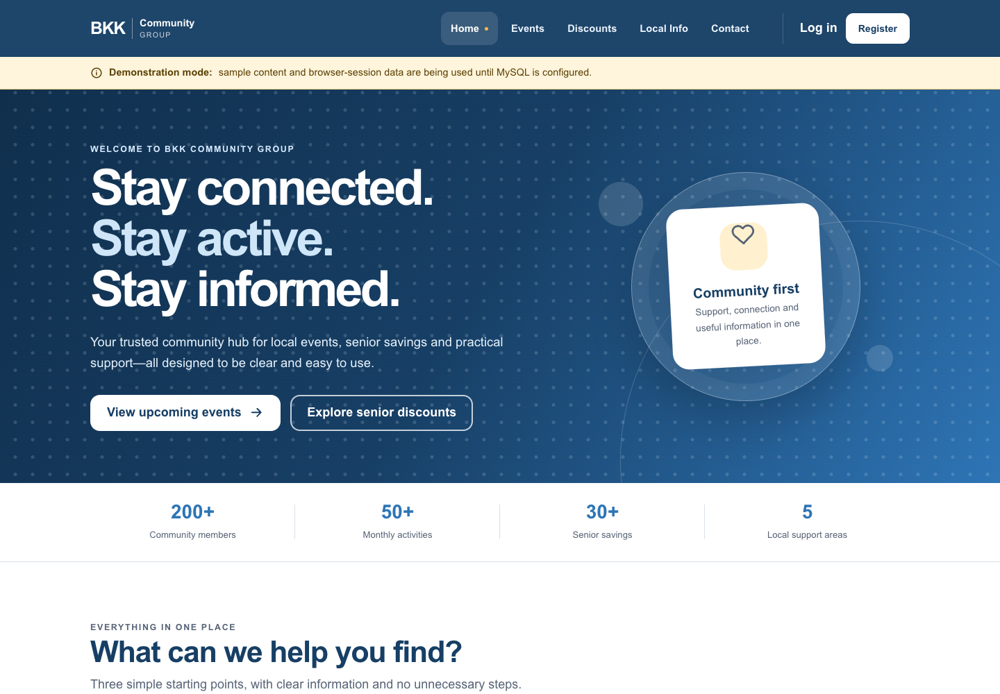

# BKK Community Web App

A responsive PHP web application for BKK Community Group, based on the documented Phase 2 high-fidelity website design and Phase 3 authentication/admin screens.



Responsive evidence is also available in [the mobile home capture](docs/screenshots/home-mobile.png) and [the desktop events capture](docs/screenshots/events-desktop.png).

## Included

- Accessible five-item public navigation: Home, Events, Discounts, Local Info and Contact.
- Responsive high-fidelity home page with community highlights and upcoming events.
- Calendar and detailed event views with category filters.
- Member registration, login, password reset, profile, RSVP/attendance history and notification preferences.
- Senior-discount filters with eligibility and claim instructions.
- Local-service directory and contact form.
- Administrator dashboard with event, discount, local-service and contact-inbox management.
- Session-only demonstration mode when MySQL is not configured.
- Shared MySQL schema compatible with the BKK Android/API project, plus sample content for persistent mode.
- CSRF protection, secure session cookies, database-backed IP/account abuse throttling and strict response security headers.
- Versioned JSON API for the Android app with hashed bearer sessions and database-required writes.
- Email-bound six-digit password-reset codes with 15-minute expiry, five-guess invalidation and session revocation.
- Database-backed API throttling for authentication, reset and contact routes.
- `/health` process-liveness and `/ready` database-readiness endpoints.

## Requirements

- PHP 8.3 or newer with PDO MySQL and mbstring. The production image uses Nginx and PHP-FPM.
- MySQL 8 or newer for persistent production data.
- Vendored Bootstrap 5.3.8 plus the BKK design system; no CDN dependency.
- A modern browser. No Node.js runtime is required.

## Run locally

```bash
cd /path/to/BKKCommunity-Web
php -S 127.0.0.1:8080 -t public public/router.php
```

Open <http://127.0.0.1:8080>. Without a `.env` file containing database credentials, the application clearly identifies itself as a session-only demo.

The `/api/v1` routes deliberately do not use the browser's session-only demo mode. If MySQL is unavailable they return HTTP 503 and confirm that nothing was saved. This prevents the Android app from displaying false success for contact, account or attendance actions.

Demo member: `member@bkk.demo` / `MemberDemo!26`

Demo administrator: `admin@bkk.demo` / `AdminDemo!26`

## Configure MySQL

1. Create a database user with access only to the BKK database.
2. For a new database, run `database/schema.sql`, followed by `database/seed.sql` if sample content is required. For an existing BKK Android/API database, run only the files in `database/migrations/` in numeric order.
3. Copy `.env.example` to `.env` and set `DB_HOST`, `DB_PORT`, `DB_NAME`, `DB_USER` and `DB_PASSWORD`.
4. Create an administrator securely from the command line:

```bash
./bin/create-admin.php
```

The command promotes an existing member or creates a new administrator without placing a password in shell history or Git.

Never commit `.env`, database passwords, SMTP credentials or hosting credentials.

## Railway configuration

This PHP/MySQL repository is the canonical backend currently serving the website, Android app and iOS app. Do not deploy the separate experimental Node/Prisma API on the same hostname unless the clients, schema and deployment are deliberately migrated together.

Set these Railway service variables:

- `APP_ENV=production`
- `APP_URL=https://bkk-community-platform-production.up.railway.app`
- `APP_TRUST_PROXY=true`
- the five `DB_*` variables supplied by Railway MySQL
- `RUN_DATABASE_INITIALIZATION=false` after the first schema creation; safe numbered migrations still run on startup
- `RESET_CODE_SECRET` generated with `php -r 'echo bin2hex(random_bytes(32)), PHP_EOL;'`
- `SMTP_HOST`, `SMTP_PORT`, `SMTP_USER`, `SMTP_PASSWORD`, `SMTP_ENCRYPTION=tls`, `MAIL_FROM`, and `MAIL_FROM_NAME=BKK Community`

Use a transactional-email provider credential and a sender address verified by that provider. Do not use a normal email-account password. After deployment, `/health` must return 200 and `/ready` must return 200 before the mobile apps are tested.

The migration adds one unmistakably labelled demonstration event so event details and RSVP can be verified without pretending it is authentic BKK information. Replace it through the protected administrator page once the stakeholder supplies a real event; its location explicitly tells users not to travel.

## Verify

```bash
find app public -type f -name '*.php' -print0 | xargs -0 -n1 php -l
./tests/smoke.sh
BKK_BASE_URL=http://127.0.0.1:8080 ./tests/database-integration.sh
BKK_BASE_URL=http://127.0.0.1:8080 ./tests/admin-database-integration.sh
BKK_BASE_URL=http://127.0.0.1:8080 ./tests/api-integration.sh
```

See [docs/API.md](docs/API.md) for the Android API contract and authentication rules.

The checked-in milestone was also exercised in headless Chrome at 1440px, 390px and 320px. Public-page Axe scans returned zero violations, mobile navigation and mouse-wheel scrolling worked, 320px pages had no horizontal overflow, guest admin access was blocked, and administrator event creation completed successfully. These automated checks do not replace real TalkBack/VoiceOver or elderly-user UAT.

## Production status and remaining blockers

The core website and `/api/v1` Android API are deployed to Railway over HTTPS with MySQL-backed content. Deployment does not make the project production-complete; the following external services and operational work remain:

- Replace all demonstration events, offers and service details with stakeholder-verified information.
- Add the real Railway SMTP credential and verify that a six-digit code reaches a registered inbox. The source is configured for authenticated TLS SMTP, but code cannot manufacture a provider account or verified sender.
- Add edge/WAF bot protection, automated encrypted backups and uptime/error monitoring.
- Wire a scheduled delivery provider for actual event-reminder and discount-alert messages; the preference data is already persisted.
- Complete real browser, screen-reader, 200% text-scale and elderly-user acceptance testing.
- Replace sample BKK content only after stakeholders verify the names, times, addresses and offers.
